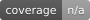

# Socket CLI

[](https://socket.dev/npm/package/socket)


[](https://twitter.com/SocketSecurity)
[](https://bsky.app/profile/socket.dev)

CLI for [Socket.dev](https://socket.dev) — bring Socket's supply-chain security analysis to your terminal and CI.

## Why this repo exists

Socket CLI is the command-line interface to [Socket.dev](https://socket.dev), letting you scan dependencies, audit packages, and gate installs from your terminal or CI. This repository is the source for the published `socket` package on npm; end-user documentation lives on [socket.dev](https://docs.socket.dev) and the [`socket` npm page](https://socket.dev/npm/package/socket).

## Install

```sh
npm install -g socket
```

Then run:

```sh
socket --help
```

## Usage

```sh
# Scan a package
socket package npm/express@4.18.0

# Scan your project's dependencies
socket scan create

# Audit an install before it runs (npm, pnpm, or yarn)
socket npm install
socket pnpm install
socket yarn add <package>
```

`socket npm`, `socket pnpm`, and `socket yarn` each run the underlying
package manager through [Socket Firewall](https://docs.socket.dev), which
blocks known-malicious packages before they are installed. Install-time
protection is no longer npm-only.

See [the Socket docs](https://docs.socket.dev) for the full command reference.

## Development

<details>
<summary>Contributor commands</summary>

```sh
git clone https://github.com/SocketDev/socket-cli.git
cd socket-cli
pnpm install
pnpm run build
pnpm test
```

Requires Node.js (see `.node-version`) and pnpm (see the `packageManager` field in `package.json`).

| Command                  | Description                   |
| ------------------------ | ----------------------------- |
| `pnpm run build`         | Smart build (skips unchanged) |
| `pnpm run build --force` | Force rebuild everything      |
| `pnpm run build:cli`     | Build CLI package only        |
| `pnpm run build:sea`     | Build SEA binaries            |
| `pnpm dev`               | Watch mode (auto-rebuild)     |
| `pnpm test`              | Run all tests                 |
| `pnpm testu`             | Update test snapshots         |
| `pnpm run check`         | Lint + typecheck              |
| `pnpm run fix`           | Auto-fix lint + formatting    |

Run the built CLI from source:

```sh
node packages/cli/dist/index.js --help
```

Enable debug logging:

```sh
SOCKET_CLI_DEBUG=1 node packages/cli/dist/index.js <command>
```

Key development environment variables:

| Variable                           | Description                                                                   |
| ---------------------------------- | ----------------------------------------------------------------------------- |
| `SOCKET_CLI_DEBUG`                 | Enable debug logging (`1`)                                                    |
| `SOCKET_CLI_API_TOKEN`             | Socket API token                                                              |
| `SOCKET_CLI_ORG_SLUG`              | Socket organization slug                                                      |
| `SOCKET_CLI_API_BASE_URL`          | Override API endpoint                                                         |
| `SOCKET_CLI_NO_API_TOKEN`          | Disable default API token                                                     |
| `SOCKET_CLI_ALLOWED_PRIVATE_HOSTS` | Comma-separated hostnames allowed to be private (see below); unset by default |

The API base URL and the npm registry URL both receive an `Authorization`
header, so the CLI refuses either one when it points at a loopback, private, or
link-local host — a repo-supplied `SOCKET_CLI_CONFIG` or `.npmrc` cannot aim the
token at `169.254.169.254` or an internal service. An enterprise Socket instance
or npm registry reached by a literal private address names that host in
`SOCKET_CLI_ALLOWED_PRIVATE_HOSTS`:

```sh
SOCKET_CLI_ALLOWED_PRIVATE_HOSTS=10.0.0.5,registry.10.0.0.6.nip.io
```

It is an allowlist rather than an off switch, so allowing your own host does not
allow every other private host.

Further contributor reading:

- [`docs/build-guide.md`](docs/build-guide.md) — build pipeline, SEA binaries, cache management
- [`docs/bundle-tools.md`](docs/bundle-tools.md) — how bundled tools (opengrep, trivy, etc.) are integrated
- [`packages/cli/README.md`](packages/cli/README.md) — CLI package architecture
- [`packages/build-infra/README.md`](packages/build-infra/README.md) — shared build tooling
- [`packages/package-builder/README.md`](packages/package-builder/README.md) — template-based package generation

</details>

## License

MIT
