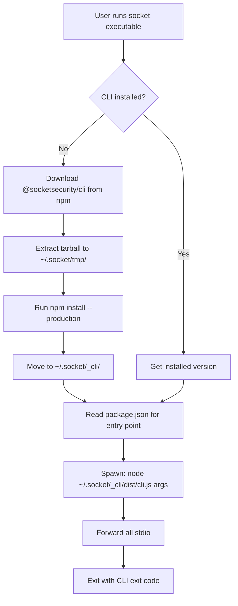

# Bootstrap Stub Architecture

This document describes Socket CLI's bootstrap stub architecture for distributing minimal executables that download the full CLI on first run.

## Overview

Socket CLI uses a **bootstrap stub pattern** where the distributed executable is a tiny wrapper (~1-5MB) that downloads the full CLI (~20MB) on first use. The stub remains "dumb" - its only job is to download and spawn the full CLI. The full CLI (in `~/.socket/_cli/`) handles all functionality including updating both itself and the stub.

This provides:

- **Minimal download size**: Users download ~1-5MB stub vs ~20MB full CLI
- **Automatic updates**: CLI can self-update and update the stub without redistributing executables
- **Platform independence**: Same architecture works for SEA, yao-pkg, and standalone binaries
- **Disk efficiency**: One shared CLI installation for multiple users (system-wide installs)
- **Robust versioning**: SHA256 hash verification ensures stub integrity

## Architecture Diagram

```
┌─────────────────────────────────────────────────────────┐
│ Distributed Stub (~1-5MB)                               │
│                                                          │
│  ┌───────────────────────────────────────────────────┐ │
│  │ Bootstrap Stub (src/sea/bootstrap.mts)            │ │
│  │                                                    │ │
│  │  • Node.js runtime (embedded, minimal)            │ │
│  │  • Ultra-thin wrapper (~280 lines)                │ │
│  │  • No external dependencies                        │ │
│  │  • Computes own SHA256 hash                       │ │
│  └───────────────────────────────────────────────────┘ │
└─────────────────────────────────────────────────────────┘
                           │
                           │ First run
                           ▼
┌─────────────────────────────────────────────────────────┐
│ npm Registry (registry.npmjs.org)                       │
│                                                          │
│  @socketsecurity/cli@latest (~20MB)                     │
└─────────────────────────────────────────────────────────┘
                           │
                           │ Download & extract
                           ▼
┌─────────────────────────────────────────────────────────┐
│ ~/.socket/_cli/ (User's home directory)                 │
│                                                          │
│  ├── package.json                                       │
│  ├── dist/                                              │
│  │   ├── cli.js (Main entry point - SMART)            │
│  │   ├── commands/self-update/ (Can update CLI+stub)   │
│  │   ├── utils.js                                       │
│  │   ├── vendor.js                                      │
│  │   └── external/                                      │
│  ├── node_modules/ (Installed dependencies)             │
│  ├── requirements.json                                  │
│  ├── translations.json                                  │
│  └── shadow-bin/                                        │
└─────────────────────────────────────────────────────────┘
                           │
                           │ Subsequent runs (with IPC)
                           ▼
┌─────────────────────────────────────────────────────────┐
│ System Node.js (from PATH)                              │
│                                                          │
│  $ node ~/.socket/_cli/dist/cli.js [args]              │
│                                                          │
│  IPC Channel receives from stub:                        │
│    • SOCKET_CLI_STUB_PATH (e.g., /usr/local/bin/socket)│
│    • SOCKET_CLI_STUB_HASH (SHA256)                     │
│    • SOCKET_CLI_STUB_SIZE (bytes)                       │
└─────────────────────────────────────────────────────────┘
```

## Bootstrap Launcher Implementation

### Location

`src/sea/bootstrap.mts` - Ultra-thin bootstrap wrapper

### Key Features

1. **Zero external dependencies** - Only Node.js built-ins (fs, path, crypto, child_process)
2. **Minimal code** - ~250 lines including comments and safety checks
3. **Configurable** - Environment variables for custom registries and paths
4. **Safe** - Path traversal protection, atomic operations
5. **Fast** - Parallel downloads, efficient extraction

### Bootstrap Flow



### Configuration

Environment variables for customization:

| Variable | Default | Description |
|----------|---------|-------------|
| `SOCKET_HOME` | `~/.socket` | Root directory for Socket CLI data |
| `SOCKET_CLI_DIR` | `~/.socket/_cli` | CLI installation directory |
| `SOCKET_NPM_REGISTRY` | `https://registry.npmjs.org` | npm registry URL |
| `NPM_REGISTRY` | (fallback) | Alternative registry env var |

### Example Usage

```bash
# First run - downloads CLI
$ ./socket --version
First run detected. Downloading Socket CLI from npm...
Downloading @socketsecurity/cli@1.1.24 from npm...
Installing dependencies...
Socket CLI downloaded successfully!
socket/1.1.24

# Subsequent runs - uses cached CLI
$ ./socket scan create
[Normal CLI output...]
```

## Installation Locations

### Default Paths

- **Linux/macOS**: `~/.socket/_cli/`
- **Windows**: `%USERPROFILE%\.socket\cli\`

### Directory Structure

```
~/.socket/
├── _cli/                          # Downloaded CLI installation
│   ├── package.json             # CLI package metadata
│   ├── dist/                    # Rollup distribution
│   │   ├── cli.js              # Main entry point
│   │   ├── npm-cli.js          # npm wrapper
│   │   ├── npx-cli.js          # npx wrapper
│   │   ├── constants.js
│   │   ├── utils.js
│   │   ├── vendor.js           # Bundled dependencies
│   │   ├── external/           # External dependencies
│   │   │   ├── @socketsecurity/
│   │   │   └── ink/
│   │   └── types/              # TypeScript definitions
│   ├── node_modules/           # Installed dependencies
│   ├── requirements.json       # Package requirements
│   ├── translations.json       # i18n translations
│   └── shadow-bin/            # Shadow binaries
│       ├── npm
│       └── npx
└── tmp/                        # Temporary download directory
    └── [hash]/                 # Per-version temp dir
        └── package.tgz         # Downloaded tarball
```

### Disk Usage

| Component | Size | Notes |
|-----------|------|-------|
| Bootstrap executable | ~1MB | Distributed to users |
| Downloaded CLI | ~30MB | Cached in `~/.socket/_cli/` |
| node_modules/ | ~15MB | Production dependencies only |
| **Total** | **~45MB** | One-time download |

## Self-Update Architecture

### Overview

Socket CLI implements a **two-tier update system**:

1. **CLI Self-Update**: The full CLI (`~/.socket/_cli/`) can update itself
2. **Stub Update**: The CLI can also update the stub binary that launched it

The stub remains "dumb" and never updates itself. All update logic lives in the full CLI.

### IPC Communication Flow

```
┌──────────────────────┐
│  Stub Binary         │
│  (socket executable) │
│  - DUMB: only knows  │
│    its own location  │
└──────────────────────┘
          │
          │ 1. Spawn CLI with IPC channel
          │    stdio: ['inherit', 'inherit', 'inherit', 'ipc']
          │
          │ 2. Send stub location via IPC
          │    { SOCKET_CLI_STUB_PATH: process.argv[0] }
          ▼
┌──────────────────────────────────────┐
│  Full CLI (~/.socket/_cli/dist/cli.js) │
│  - SMART: handles all logic          │
├──────────────────────────────────────┤
│  Receives via IPC:                   │
│    • SOCKET_CLI_STUB_PATH            │
│                                      │
│  On self-update:                     │
│   1. Check CLI version                │
│   2. Download new CLI if needed      │
│   3. Read stub at STUB_PATH          │
│   4. Compute SHA256 hash             │
│   5. Compare vs known-good hashes    │
│   6. Download new stub if outdated   │
│   7. Atomically replace stub binary  │
└──────────────────────────────────────┘
```

### Stub Sends Location Only

The stub only sends its own location - it doesn't compute hashes or sizes:

```typescript
// In bootstrap.mts (lines 259-266)
child.on('spawn', () => {
  const stubPath = process.argv[0]
  if (stubPath) {
    child.send?.({
      SOCKET_CLI_STUB_PATH: stubPath,
    })
  }
})
```

This keeps the stub minimal - all intelligence lives in the CLI.

### CLI Receives Stub Location

The CLI receives only the stub path via IPC (implemented in `src/utils/stub-ipc.mts` and `src/cli.mts`):

```typescript
// In constants.mts (lines 222-231)
export type IpcObject = Readonly<{
  // ... other IPC fields
  SOCKET_CLI_STUB_PATH?: string | undefined
}>

// In cli.mts - Initialize at startup
initStubIpcHandler()

// In stub-ipc.mts - Store received path
let stubPath: string | undefined

process.on('message', (message: unknown) => {
  if (message && typeof message === 'object' && 'SOCKET_CLI_STUB_PATH' in message) {
    stubPath = (message as IpcObject).SOCKET_CLI_STUB_PATH
  }
})

// Export getter for other modules
export function getStubPath(): string | undefined {
  return stubPath
}
```

### CLI Computes Hash When Needed

The CLI reads and hashes the stub only when checking for updates (in `src/commands/self-update/handle-self-update.mts`):

```typescript
// Get stub path from IPC
const stubPath = getStubPath()

if (stubPath && existsSync(stubPath)) {
  // Read stub binary
  const stubContent = await fs.readFile(stubPath)

  // Compute hash
  const currentHash = crypto.createHash('sha256')
    .update(stubContent)
    .digest('hex')

  // Compare against available stub assets in release
  // ... rest of update logic
}
```

### Stub Update Process

When `socket self-update` runs (implemented in `src/commands/self-update/handle-self-update.mts`):

```typescript
// Get stub path from IPC (received at CLI startup)
const stubPath = getStubPath()

if (stubPath && existsSync(stubPath)) {
  // 1. Read current stub binary and compute hash
  const stubContent = await fs.readFile(stubPath)
  const currentHash = crypto.createHash('sha256')
    .update(stubContent)
    .digest('hex')

  logger.info(`Current stub hash: ${currentHash}`)

  // 2. Check if stub asset exists in GitHub release
  const stubAssetName = `socket-stub-${process.platform}-${process.arch}${process.platform === 'win32' ? '.exe' : ''}`
  const stubAsset = release.assets.find(asset => asset.name === stubAssetName)

  if (stubAsset) {
    // 3. Download new stub
    await downloadFile(stubAsset.browser_download_url, downloadPath)

    // 4. Create backup of current stub
    const backupPath = await createBackup(stubPath)

    // 5. Atomically replace stub binary
    await replaceBinary(stagingPath, stubPath)

    logger.info('✓ Bootstrap stub updated successfully!')
  } else {
    logger.info('No stub binary found in release')
  }
}
```

**Implementation Notes:**
- Stub update is called automatically during `socket self-update`
- Works even if CLI is already up-to-date (checks stub independently)
- Uses same atomic replacement logic as CLI binary updates
- Creates backups with rollback capability on failure
- Currently relies on HTTPS + GitHub releases for security
- TODO: Add cryptographic signature verification for stub binaries

### Atomic Stub Replacement

Similar to SEA binary updates (from `handle-self-update.mts:192-227`):

```typescript
async function replaceStub(newPath: string, currentPath: string): Promise<void> {
  // Ensure executable and clear macOS quarantine
  await ensureExecutable(newPath)
  await clearQuarantine(newPath)

  if (process.platform === 'win32') {
    // Windows: Move current to temp, then replace
    const tempName = `${currentPath}.old.${Date.now()}`
    await fs.rename(currentPath, tempName)

    try {
      await fs.rename(newPath, currentPath)
      await remove(tempName).catch(() => {})
    } catch (error) {
      // Restore on failure
      await fs.rename(tempName, currentPath).catch(() => {})
      throw error
    }
  } else {
    // Unix: Atomic rename
    await fs.rename(newPath, currentPath)
  }
}
```

### Security Considerations

#### Hash-Based Verification

- **Algorithm**: SHA256 (256-bit, cryptographically secure)
- **Performance**: ~5ms for 5KB stub, ~20ms for 20MB CLI
- **Integrity**: Detects any bit-level corruption or tampering

#### Known-Good Hashes

Stub hashes are stored in:
1. **npm package metadata**: `@socketsecurity/cli` package.json
2. **GitHub release assets**: `stub-hashes.json` in each release
3. **Embedded in CLI**: Compiled-in hash map for offline verification

Example `stub-hashes.json`:
```json
{
  "1.1.24": {
    "darwin-arm64": "81b27bcc09c973dd2a4d1edd1b1b963eb3ee7f363c32fc889ba5f7ac3f37ad55",
    "darwin-x64": "f3a8c2b9...",
    "linux-arm64": "9d4e5f1a...",
    "linux-x64": "2c7b8d3e...",
    "win32-x64": "6a1f9c4b..."
  }
}
```

### Manual Updates

Users can manually update:

```bash
# Update CLI only (stub checks and downloads if needed)
socket self-update

# Force re-download CLI (stub will re-download on next run)
rm -rf ~/.socket/_cli
socket --version

# Clean everything including temp files
rm -rf ~/.socket
socket --version
```

## Security Considerations

### Package Integrity

**Current:**
- Downloads from official npm registry (`registry.npmjs.org`)
- npm registry provides SHA integrity checks
- HTTPS transport encryption

**Future Enhancements:**
- GPG signature verification of tarballs
- Subresource Integrity (SRI) for downloads
- Pinned version with hash verification

### Path Safety

Bootstrap includes path traversal protection:

```javascript
// Prevents ../../../etc/passwd type attacks
if (!options?.force) {
  const cwd = process.cwd()
  const relation = path.relative(cwd, absolutePath)
  const isInside = Boolean(
    relation &&
      relation !== '..' &&
      !relation.startsWith(`..${path.sep}`)
  )
  if (!isInside) {
    throw new Error('Cannot delete files/directories outside cwd')
  }
}
```

### Atomic Operations

1. **Download to temp directory** (`~/.socket/tmp/[hash]/`)
2. **Extract and install** in temp location
3. **Atomic move** to final location
4. **Cleanup** temp on success or failure

This prevents corrupted installations from partial downloads.

## Platform Support

### Supported Platforms

| Platform | Support | Notes |
|----------|---------|-------|
| Linux x64 | ✅ Full | Primary platform |
| Linux ARM64 | ✅ Full | Raspberry Pi, AWS Graviton |
| macOS x64 | ✅ Full | Intel Macs |
| macOS ARM64 | ✅ Full | Apple Silicon |
| Windows x64 | ✅ Full | Requires system Node.js |
| Windows ARM64 | ⚠️ Limited | Experimental |

### Platform-Specific Notes

**macOS:**
- SEA executables are code-signed for Gatekeeper
- Ad-hoc signatures for local development
- Developer ID signatures for distribution

**Windows:**
- Requires `tar` command (built-in on Windows 10+)
- Executable signing via `signtool` (optional)
- May trigger SmartScreen on first run (unsigned)

**Linux:**
- Works on all major distributions
- No additional dependencies required
- AppImage support (future)

## Build Variants

Socket CLI supports multiple build variants with the same bootstrap architecture:

### 1. SEA (Single Executable Application)

**Size:** ~60-80MB
**Bootstrap:** Embedded in Node.js runtime
**Pros:**
- Official Node.js feature
- Good compression
- Native WASM support

**Cons:**
- Larger than yao-pkg
- Slower build time

### 2. yao-pkg (Package as executable)

**Size:** ~44MB (macOS), ~22-31MB (Linux/Windows with UPX)
**Bootstrap:** Can be embedded or separate
**Pros:**
- Excellent compression (with UPX)
- Fast builds
- Mature tooling

**Cons:**
- Requires custom Node.js build
- Community-maintained fork

### 3. Standalone (npm install)

**Size:** ~30MB (no bootstrap)
**Bootstrap:** Not applicable
**Pros:**
- No bundling overhead
- Standard npm workflow
- Easiest updates

**Cons:**
- Requires Node.js pre-installed
- Slower startup (module resolution)

## Comparison with Full Bundle

| Metric | Bootstrap | Full Bundle | Difference |
|--------|-----------|-------------|------------|
| **Download size** | ~1MB | ~30MB | **97% smaller** |
| **First run time** | ~10s | <1s | Slower (download) |
| **Subsequent runs** | <1s | <1s | Same |
| **Disk usage** | ~45MB | ~30MB | +15MB (node_modules) |
| **Update method** | Delete cache | Redownload | Simpler |
| **Offline support** | After 1st run | Always | Limited |

## Error Handling

### Common Errors

**No Node.js in PATH:**
```
Error: Node.js is required to run Socket CLI
The SEA wrapper has downloaded the CLI but needs Node.js to execute it.
Please install Node.js from https://nodejs.org/
```

**Network errors:**
```
Failed to fetch package info: 404 Not Found
```

**Disk space:**
```
ENOSPC: no space left on device
```

**Permissions:**
```
EACCES: permission denied, mkdir '~/.socket/_cli'
```

### Recovery

Users can manually recover from errors:

```bash
# Clean up corrupted installation
rm -rf ~/.socket/_cli
rm -rf ~/.socket/tmp

# Retry
socket --version
```

## Testing

### Local Testing

Test the bootstrap locally before distribution:

```bash
# Build bootstrap bundle
pnpm run build:sea

# Test first run (delete cache first)
rm -rf ~/.socket/_cli
./socket --version

# Test subsequent run
./socket --version

# Test with custom registry
SOCKET_NPM_REGISTRY=http://localhost:4873 ./socket --version
```

### CI Testing

Test bootstrap in CI:

```yaml
- name: Test bootstrap launcher
  run: |
    # Build executable
    pnpm run build:sea

    # Test first run
    rm -rf ~/.socket/_cli
    ./socket --version

    # Verify installation
    test -d ~/.socket/_cli
    test -f ~/.socket/_cli/package.json

    # Test subsequent run
    ./socket --help
```

## Future Enhancements

### Planned Features

1. **Background updates**: Check for updates in background, download asynchronously
2. **Version pinning**: Lock to specific CLI version via config file
3. **Multi-version support**: Keep multiple CLI versions, switch via `socket use 1.2.3`
4. **Offline mode**: Bundle minimal CLI in executable as fallback
5. **Compression**: Use brotli/zstd for faster downloads
6. **Delta updates**: Download only changed files between versions
7. **Mirror support**: Fallback mirrors for registry downtime
8. **Telemetry**: Anonymous usage statistics for download success rates

### Alternative Architectures

**Hybrid bundle:**
- Include minimal CLI in executable (~5MB)
- Download full CLI on first use of advanced features
- Best of both worlds: fast startup + small size

**Lazy loading:**
- Download commands on-demand
- `socket scan` downloads scan command only
- Reduces initial download to <100KB

## References

- Bootstrap implementation: `src/sea/bootstrap.mts`
- SEA documentation: `docs/SEA_PLATFORM_SUPPORT.md`
- yao-pkg documentation: `docs/YAO_PKG_BUILD.md`
- CI setup: `docs/YAO_PKG_CI_SETUP.md`
